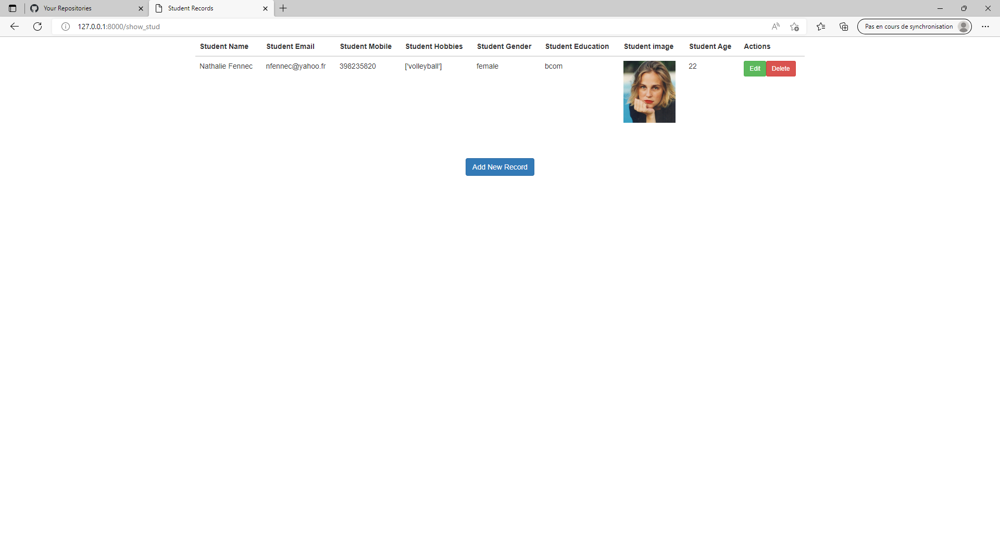

# Student_project

## Sommaire 

* [1. Installation](#Section_1) 
* [2. Création des modèles et forms](#Section_2)
* [3. Views et CRUD](#Section_3)
* [4. Les Templates](#Section_4)
* [5. URLs et Routes](#Section_5)


## 1. Installation<a class="anchor" id="section_1"></a>  


```
pip install django==3.0.2
```
Création d'un projet :
```
django-admin startproject Student_project
```
Création d'une application (compte, CRUD) :

```
django-admin startapp compte
```
```
django-admin startapp CRUD
```

projet/settings.py :

```python
"""
Django settings for CRUD project.

Generated by 'django-admin startproject' using Django 3.0.2.

For more information on this file, see
https://docs.djangoproject.com/en/3.0/topics/settings/

For the full list of settings and their values, see
https://docs.djangoproject.com/en/3.0/ref/settings/
"""

import os

# Build paths inside the project like this: os.path.join(BASE_DIR, ...)
BASE_DIR = os.path.dirname(os.path.dirname(os.path.abspath(__file__)))


# Quick-start development settings - unsuitable for production
# See https://docs.djangoproject.com/en/3.0/howto/deployment/checklist/

# SECURITY WARNING: keep the secret key used in production secret!
SECRET_KEY = 'oe6aq*(3*n-!v$hfgh#!pf@9p((z8$*jbn-ha&wct3$9j!cqt='

# SECURITY WARNING: don't run with debug turned on in production!
DEBUG = True

# ALL Allowed hosts
ALLOWED_HOSTS = ['*']  # Ajout


# Application definition

INSTALLED_APPS = [
    'django.contrib.admin',
    'django.contrib.auth',
    'django.contrib.contenttypes',
    'django.contrib.sessions',
    'django.contrib.messages',
    'django.contrib.staticfiles',
    'student', # Ajout
    'compte', # Ajout
]

MIDDLEWARE = [
    'django.middleware.security.SecurityMiddleware',
    'django.contrib.sessions.middleware.SessionMiddleware',
    'django.middleware.common.CommonMiddleware',
    'django.middleware.csrf.CsrfViewMiddleware',
    'django.contrib.auth.middleware.AuthenticationMiddleware',
    'django.contrib.messages.middleware.MessageMiddleware',
    'django.middleware.clickjacking.XFrameOptionsMiddleware',
]

ROOT_URLCONF = 'CRUD.urls'

TEMPLATES = [
    {
        'BACKEND': 'django.template.backends.django.DjangoTemplates',
        'DIRS': [os.path.join(BASE_DIR, 'templates')], # Ajout
        'APP_DIRS': True,
        'OPTIONS': {
            'context_processors': [
                'django.template.context_processors.debug',
                'django.template.context_processors.request',
                'django.contrib.auth.context_processors.auth',
                'django.contrib.messages.context_processors.messages',
            ],
        },
    },
]

WSGI_APPLICATION = 'CRUD.wsgi.application'


# Database
# https://docs.djangoproject.com/en/3.0/ref/settings/#databases

DATABASES = {
    'default': {
        'ENGINE': 'django.db.backends.sqlite3',
        'NAME': os.path.join(BASE_DIR, 'db.sqlite3'),
    }
}


# Password validation
# https://docs.djangoproject.com/en/3.0/ref/settings/#auth-password-validators

AUTH_PASSWORD_VALIDATORS = [
    {
        'NAME': 'django.contrib.auth.password_validation.UserAttributeSimilarityValidator',
    },
    {
        'NAME': 'django.contrib.auth.password_validation.MinimumLengthValidator',
    },
    {
        'NAME': 'django.contrib.auth.password_validation.CommonPasswordValidator',
    },
    {
        'NAME': 'django.contrib.auth.password_validation.NumericPasswordValidator',
    },
]


# Internationalization
# https://docs.djangoproject.com/en/3.0/topics/i18n/

LANGUAGE_CODE = 'en-us'

TIME_ZONE = 'UTC'

USE_I18N = True

USE_L10N = True

USE_TZ = True


# Static files (CSS, JavaScript, Images)
# https://docs.djangoproject.com/en/3.0/howto/static-files/

# CSS , JS Files
STATIC_URL = '/static/'  # Ajout
STATICFILES_DIRS = [os.path.join(BASE_DIR, 'static')] # Ajout


#User_Uploaded_Files
MEDIA_URL = '/media/' # Ajout
MEDIA_ROOT = os.path.join(BASE_DIR, 'media/') # Ajout
```

Run server : 
```python
python manage.py runserver 0:8000
```

## 2. Création des modèles et forms<a class="anchor" id="section_2"></a>  

student/models.py :
```python
from django.db import models


class Stud(models.Model):
    name = models.CharField(max_length=50)
    email = models.EmailField(blank=True)
    number = models.IntegerField()
    hobbies = models.CharField(blank=True, max_length=255)
    gender = models.CharField(blank=True, max_length=50)
    education = models.CharField(blank=True, max_length=50)
    image = models.FileField(upload_to='student_image', blank=True)
    age = models.CharField(blank=True, max_length=50)

    class Meta:
        db_table = "student"
```

student/forms.py:
```python
#student/forms.py
from django import forms
from .models import Stud

class StudForm(forms.ModelForm):
    name= forms.CharField(widget= forms.TextInput(attrs={'class':'form-control','placeholder':'Enter name'}))
    email= forms.EmailField(widget= forms.EmailInput(attrs={'class':'form-control','placeholder':'Enter Email','help_text':'A valid email address'}))
    number= forms.IntegerField(widget= forms.NumberInput(attrs={'class':'form-control','min':'0','placeholder':'Enter Number'}))

    checkbox = [('cricket','Cricket'),('barchhi_fek','Barchhi Fek'),('volleyball','Volleyball'),('basket_ball','Basket Ball')]

    hobbies = forms.MultipleChoiceField(required=False,widget= forms.CheckboxSelectMultiple, choices=checkbox)
    radiobutton = [('male','Male'),('female','Female')]
    gender = forms.ChoiceField(widget= forms.RadioSelect, choices=radiobutton)
    selectoption = [('bba','BBA'),('bca','BCA'),('bcom','BCOM'),('b.ed','B.ed')]
    education = forms.ChoiceField(widget= forms.Select(attrs={ "class":"form-control input_felid"}),choices=selectoption)
    image = forms.FileField(required=False,widget= forms.FileInput(attrs={ 'class':'form-control'}))
    age = forms.IntegerField(widget= forms.NumberInput(attrs={'class':'form-control','min':'0','max':'100','placeholder':'Enter Age'}))

    class Meta:
        model = Stud
        fields = '__all__'
```

compte/forms.py:
```python
from django.forms import ModelForm
from django.contrib.auth.forms import UserCreationForm
from django.contrib.auth.models import User
from django import forms

class CreerUtilisateur(UserCreationForm):
    class Meta:
        model = User
        fields = ['username','email', 'password1', 'password2']

```

```
python manage.py makemigrations
python manage.py migrate
```
Create superadmin:
````python
python manage.py createsuperuser
````

student/admin.py :

````python
from django.contrib import admin
from .models import Stud

# Register your models here.
admin.site.register(Stud)
````
## 3. Views et CRUD<a class="anchor" id="section_3"></a>  

compte/views.py:
```python
from django.contrib.auth import authenticate, login, logout
from django.shortcuts import render, redirect
from django.contrib.auth.forms import UserCreationForm
from .forms import CreerUtilisateur
from django.contrib import messages

# Create your views here.

def inscriptionPage(request):
    form = CreerUtilisateur
    if request.method == 'POST':
        form = CreerUtilisateur(request.POST)
        if form.is_valid():
            form.save()
            user=form.cleaned_data.get('username')
            messages.success(request,'Compte crée  avec succès pour ' + user)
            return redirect('acces')
    context = {'form': form}
    return render(request, 'compte/inscription.html', context)


def accesPage(request):
    context = {}
    if request.method == 'POST':
        username = request.POST.get('username')
        password = request.POST.get('password')
        user = authenticate(request, username=username,password=password)
        if user is not None:
            login(request, user)
            return redirect('show_stud')
        else:
            messages.info(request, 'Erreur dans le mot de passe ou le nom d\'utilisateur')
    return render(request, 'compte/access.html')


def logoutUser(request):
    logout(request)
    return redirect('acces')
```

student/views.py:
````python
from django.shortcuts import render, redirect
from .forms import StudForm
from .models import Stud
from django.http import HttpResponse
from django.contrib import messages
from django.contrib.auth.decorators import login_required


@login_required(login_url='acces')
def create_stud(request):
    form = StudForm()
    if request.method == "POST":
        form = StudForm(request.POST, request.FILES)

        if form.is_valid():
            try:
                form.save()
                messages.success(request, "Created successful!")
                return redirect('/show_stud')
            except:
                message = "Something we are wrong!"
                form = StudForm()
            return render(request, 'create.html', {'message': message, 'form': form})
    else:
        form = StudForm()
    return render(request, 'create.html', {'form': form})


@login_required(login_url='acces')
def show_stud(request):
    stud = Stud.objects.order_by('-id');
    return render(request, 'index.html', {'stud': stud})


@login_required(login_url='acces')
def edit_stud(requst, id):
    stud = Stud.objects.get(id=id)
    return render(requst, 'edit.html', {'stud': stud})


@login_required(login_url='acces')
def update_stud(request, id):
    stud = Stud.objects.get(id=id)
    if request.method == "POST":
        form = StudForm(request.POST, request.FILES, instance=stud)
        if form.is_valid():
            form.save()
            messages.success(request, 'Update successful!')
            return redirect("/show_stud")
        message = 'Something we are wrong!'
        return render(request, 'edit.html', {'message': message, 'stud': form})
    else:
        form = Stud.objects.get(id=id)
        stud = StudForm(instance=form)
        content = {'stud': stud, 'id': id}
        return render(request, 'edit.html', content)


@login_required(login_url='acces')
def delete_stud(request, id):
    stud = Stud.objects.get(id=id)
    stud.delete()
    messages.success(request, 'Deleted successful!')
    return redirect("/show_stud")
````

## 4. Les Templates<a class="anchor" id="section_4"></a>  
create.html :
```html

<!DOCTYPE html>
<html lang="en">
<head>
    <meta charset="UTF-8">
    <title>Create</title>
    
    <link rel="stylesheet" href="https://maxcdn.bootstrapcdn.com/bootstrap/3.4.1/css/bootstrap.min.css">
</head>
<body>
    <form method="POST" class="post-form" action="/create_stud" enctype="multipart/form-data">
        
        <div class="container">
            <br>
            <div class="form-group row">
                <label class="col-sm-1 col-form-label"></label>
                <div class="col-sm-4">
                    <h3>Student Details</h3>
                </div>
            </div>
            <div class="form-group row">
                <label class="col-sm-2 col-form-label">Student Name:</label>
                <div class="col-sm-4">
                    {{ form.name }}
                </div>
            </div>
            <div class="form-group row">
                <label class="col-sm-2 col-form-label">Student Email:</label>
                <div class="col-sm-4">
                    {{ form.email }}
                </div>
            </div>
            <div class="form-group row">
                <label class="col-sm-2 col-form-label">Student Phone:</label>
                <div class="col-sm-4">
                    {{ form.number }}
                </div>
            </div>
            <div class="form-group row">
                 <label class="col-sm-2 col-form-label">Student Hobbis:</label>
                    <div class="col-sm-4">
                        {{ form.hobbies }}
                    </div>
            </div>
            <div class="form-group row">
                <label class="col-sm-2 col-form-label">Student Gender:</label>
                    <div class="col-sm-4">
                        {{ form.gender }}
                    </div>
            </div>
            <div class="form-group row">
                <label class="col-sm-2 col-form-label">Student Education:</label>
                    <div class="col-sm-4">
                        {{ form.education }}
                    </div>
            </div>
            <div class="form-group row">
                <label class="col-sm-2 col-form-label">Student image:</label>
                    <div class="col-sm-4">
                        {{ form.image }}
                    </div>
            </div>
            <div class="form-group row">
                <label class="col-sm-2 col-form-label">Student Age:</label>
                    <div class="col-sm-4">
                        {{ form.age }}
                    </div>
            </div>
            <div class="form-group row">
                <label class="col-sm-1 col-form-label"></label>
                <div class="col-sm-4">
                    <button type="submit" class="btn btn-primary">Submit</button>
                </div>
            </div>
        </div>
    </form>
    <script src="https://code.jquery.com/jquery-3.4.1.min.js" />
    <script src="https://maxcdn.bootstrapcdn.com/bootstrap/3.4.1/js/bootstrap.min.js" />
</body>
</html>
```
edit.html :
```html

<!DOCTYPE html>
<html lang="en">
<head>
    <meta charset="UTF-8">
    <title>Edit</title>
    
    <link rel="stylesheet" href="https://maxcdn.bootstrapcdn.com/bootstrap/3.4.1/css/bootstrap.min.css">
</head>
<body>
        <form method="POST" class="post-form" action="/update_stud/{{id}}" enctype="multipart/form-data">
        
        <div class="container">
            <div class="form-group row">
                <label class="col-sm-1 col-form-label"></label>
                <div class="col-sm-4">
                    <h3>Student Details</h3>
                </div>
            </div>
            <div class="form-group row">
                <label class="col-sm-2 col-form-label">Student Name:</label>
                <div class="col-sm-4">
                     {{ stud.name }}
                </div>
            </div>
            <div class="form-group row">
                <label class="col-sm-2 col-form-label">Student Email:</label>
                <div class="col-sm-4">
                    {{ stud.email }}
                </div>
            </div>
            <div class="form-group row">
                <label class="col-sm-2 col-form-label">Student Phone:</label>
                <div class="col-sm-4">
                    {{ stud.number }}
                </div>
            </div>
            <div class="form-group row">
                 <label class="col-sm-2 col-form-label">Student Hobbis:</label>
                    <div class="col-sm-4">
                        <label for="id_hobbies_0"><input type="checkbox" name="hobbies" checked value="cricket" id="id_hobbies_0">Cricket</label>
                        <label for="id_hobbies_1"><input type="checkbox" name="hobbies" checked value="barchhi_fek" id="id_hobbies_1">Barchhi Fek</label><br>
                        <label for="id_hobbies_2"><input type="checkbox" name="hobbies" checked value="volleyball" id="id_hobbies_2">Volleyball</label>
                        <label for="id_hobbies_3"><input type="checkbox" name="hobbies" checked value="basket_ball" id="id_hobbies_3">Basket Ball</label>
                    </div>
            </div>
            <div class="form-group row">
                <label class="col-sm-2 col-form-label">Student Gender:</label>
                    <div class="col-sm-4">
                            {{ stud.gender }}
                    </div>
            </div>
            <div class="form-group row">
                <label class="col-sm-2 col-form-label">Student Education:</label>
                    <div class="col-sm-4">
                            {{ stud.education }}
                    </div>
            </div>
            <div class="form-group row">
                <label class="col-sm-2 col-form-label">Student image:</label>
                    <div class="col-sm-4">
                            {{ stud.image }}
                            
                                    
                            
                    </div>
            </div>
            <div class="form-group row">
                <label class="col-sm-2 col-form-label">Student Age:</label>
                    <div class="col-sm-4">
                            {{ stud.age }}
                    </div>
            </div>
            <div class="form-group row">
                <label class="col-sm-1 col-form-label"></label>
                <div class="col-sm-4">
                    <button type="submit" class="btn btn-primary">Submit</button>
                </div>
            </div>
        </div>
    </form>
    <script src="https://code.jquery.com/jquery-3.4.1.min.js" />
    <script src="https://maxcdn.bootstrapcdn.com/bootstrap/3.4.1/js/bootstrap.min.js" />
</body>
</html>
```
index.html :
```html
<!DOCTYPE html>
<html lang="en">
<head>
    <meta charset="UTF-8">
    <title>Student Records</title>
    
    <link rel="stylesheet" href="https://maxcdn.bootstrapcdn.com/bootstrap/3.4.1/css/bootstrap.min.css">
</head>
<body>
    <div class="container">
        <div class="row">
            
            <ul class="messages">
                
                     <li   class=" {{ message.tags }} " > {{ message }} </li>
                
            </ul>
            
            <table class="table table-hover">
                <thead>
                    <tr>
                        <th>Student Name</th>
                        <th>Student Email</th>
                        <th>Student Mobile</th>
                        <th>Student Hobbies</th>
                        <th>Student Gender</th>
                        <th>Student Education</th>
                        <th>Student image</th>
                        <th>Student Age</th>
                        <th>Actions</th>
                    </tr>
                </thead>
                <tbody>
                    
                    <tr>
                        <td>{{ value.name }}</td>
                        <td>{{ value.email }}</td>
                        <td>{{ value.number }}</td>
                        <td>{{ value.hobbies }}</td>
                        <td>{{ value.gender }}</td>
                        <td>{{ value.education }}</td>
                        <td></td>
                        <td>{{ value.age }}</td>
                        <td><a class="btn btn-success btn-sm" href="/update_stud/{{ value.id }}">  Edit</a><a class="btn btn-danger btn-sm" onclick="return confirm('Do you really want to delete this item!')" href="/delete_stud/{{ value.id }}"> Delete</a></td>
                    </tr>
                    
                    <tr><td>No Record Found!</td></tr>
                    
                </tbody>
            </table>
        </div>
    </div>
    <br><br>
    <center><a href="/create_stud" class="btn btn-primary">Add New Record</a></center>
    <script src="https://code.jquery.com/jquery-3.4.1.min.js" />
    <script src="https://maxcdn.bootstrapcdn.com/bootstrap/3.4.1/js/bootstrap.min.js" />
</body>
</html>
```

compte/access.html :
```html
<!DOCTYPE html>
<html>

<head>
	<title>Accès</title>
	<link rel="stylesheet" href="https://stackpath.bootstrapcdn.com/bootstrap/4.1.3/css/bootstrap.min.css" integrity="sha384-MCw98/SFnGE8fJT3GXwEOngsV7Zt27NXFoaoApmYm81iuXoPkFOJwJ8ERdknLPMO" crossorigin="anonymous">
	<script src="https://ajax.googleapis.com/ajax/libs/jquery/3.3.1/jquery.min.js"></script>
	<link rel="stylesheet" href="https://use.fontawesome.com/releases/v5.6.1/css/all.css" integrity="sha384-gfdkjb5BdAXd+lj+gudLWI+BXq4IuLW5IT+brZEZsLFm++aCMlF1V92rMkPaX4PP" crossorigin="anonymous">


	<style>
		body,
		html {
			margin: 0;
			padding: 0;
			height: 100%;
			background: #7abecc !important;
		}
		.user_card {
			width: 350px;
			margin-top: auto;
			margin-bottom: auto;
			background: #74cfbf;
			position: relative;
			display: flex;
			justify-content: center;
			flex-direction: column;
			padding: 10px;
			box-shadow: 0 4px 8px 0 rgba(0, 0, 0, 0.2), 0 6px 20px 0 rgba(0, 0, 0, 0.19);
			-webkit-box-shadow: 0 4px 8px 0 rgba(0, 0, 0, 0.2), 0 6px 20px 0 rgba(0, 0, 0, 0.19);
			-moz-box-shadow: 0 4px 8px 0 rgba(0, 0, 0, 0.2), 0 6px 20px 0 rgba(0, 0, 0, 0.19);
			border-radius: 5px;

		}

		.form_container {
			margin-top: 20px;
		}

		#form-title{
			color: #fff;

		}

		.login_btn {
			width: 100%;
			background: #33ccff !important;
			color: white !important;
		}
		.login_btn:focus {
			box-shadow: none !important;
			outline: 0px !important;
		}
		.login_container {
			padding: 0 2rem;
		}
		.input-group-text {
			background: #f7ba5b !important;
			color: white !important;
			border: 0 !important;
			border-radius: 0.25rem 0 0 0.25rem !important;
		}
		.input_user,
		.input_pass:focus {
			box-shadow: none !important;
			outline: 0px !important;
		}

		#messages{
			background-color: grey;
			color: #fff;
			padding: 10px;
			margin-top: 10px;
		}
	</style>

</head>
<body>
	<div class="container h-100">
		<div class="d-flex justify-content-center h-100">
			<div class="user_card">
				<div class="d-flex justify-content-center">


					<h3 id="form-title">LOGIN</h3>
				</div>
				<div class="d-flex justify-content-center form_container">
					<form method="POST" action="">
						
						<div class="input-group mb-3">
							<div class="input-group-append">
								<span class="input-group-text"><i class="fas fa-user"></i></span>
							</div>
							<input type="text" name="username" placeholder="Nom d'utilisateur..." class="form-control">
						</div>
						<div class="input-group mb-2">
							<div class="input-group-append">
								<span class="input-group-text"><i class="fas fa-key"></i></span>
							</div>
								<input type="password" name="password" placeholder="Mot de passe..." class="form-control" >
						</div>

							<div class="d-flex justify-content-center mt-3 login_container">
				 				<input class="btn login_btn" type="submit" value="Se connecter">
				   			</div>
					</form>

				</div>
				
				<p id="messages">{{message}}</p>
				
				<div class="mt-4">
					<div class="d-flex justify-content-center links">
						Avez-vous un compte? <a href="" class="ml-2">Inscrivez-vous</a>
					</div>

				</div>
			</div>
		</div>
	</div>
</body>

</html>
```

compte/inscription :
```html
<!DOCTYPE html>
<html>

<head>
	<title>Login</title>
	<link rel="stylesheet" href="https://stackpath.bootstrapcdn.com/bootstrap/4.1.3/css/bootstrap.min.css" integrity="sha384-MCw98/SFnGE8fJT3GXwEOngsV7Zt27NXFoaoApmYm81iuXoPkFOJwJ8ERdknLPMO" crossorigin="anonymous">
	<script src="https://ajax.googleapis.com/ajax/libs/jquery/3.3.1/jquery.min.js"></script>
	<link rel="stylesheet" href="https://use.fontawesome.com/releases/v5.6.1/css/all.css" integrity="sha384-gfdkjb5BdAXd+lj+gudLWI+BXq4IuLW5IT+brZEZsLFm++aCMlF1V92rMkPaX4PP" crossorigin="anonymous">

	<style>
		body,
		html {
			margin: 0;
			padding: 0;
			height: 100%;
			background: #7abecc !important;
		}
		.user_card {
			width: 350px;
			margin-top: auto;
			margin-bottom: auto;
			background: #74cfbf;
			position: relative;
			display: flex;
			justify-content: center;
			flex-direction: column;
			padding: 10px;
			box-shadow: 0 4px 8px 0 rgba(0, 0, 0, 0.2), 0 6px 20px 0 rgba(0, 0, 0, 0.19);
			-webkit-box-shadow: 0 4px 8px 0 rgba(0, 0, 0, 0.2), 0 6px 20px 0 rgba(0, 0, 0, 0.19);
			-moz-box-shadow: 0 4px 8px 0 rgba(0, 0, 0, 0.2), 0 6px 20px 0 rgba(0, 0, 0, 0.19);
			border-radius: 5px;

		}

		.form_container {
			margin-top: 20px;
		}

		#form-title{
			color: #fff;
		}
		.login_btn {
			width: 100%;
			background: #33ccff !important;
			color: white !important;
		}
		.login_btn:focus {
			box-shadow: none !important;
			outline: 0px !important;
		}
		.login_container {
			padding: 0 2rem;
		}
		.input-group-text {
			background: #f7ba5b !important;
			color: white !important;
			border: 0 !important;
			border-radius: 0.25rem 0 0 0.25rem !important;
		}
		.input_user,
		.input_pass:focus {
			box-shadow: none !important;
			outline: 0px !important;
		}

	</style>

</head>
<body>
	<div class="container h-100">
		<div class="d-flex justify-content-center h-100">
			<div class="user_card">
				<div class="d-flex justify-content-center">
					<h3 id="form-title">INSCRIPTION</h3>
				</div>
				<div class="d-flex justify-content-center form_container">

					<form method="POST" action="">
                        
						<div class="input-group mb-2">
							<div class="input-group-append">
								<span class="input-group-text"><i class="fas fa-user"></i></span>
							</div>
							{{form.username}}
						</div>
						<div class="input-group mb-2">
							<div class="input-group-append">
								<span class="input-group-text"><i class="fas fa-envelope-square"></i></span>
							</div>
							{{form.email}}
						</div>
						<div class="input-group mb-2">
							<div class="input-group-append">
								<span class="input-group-text"><i class="fas fa-key"></i></span>
							</div>
							{{form.password1}}
						</div>
						<div class="input-group mb-2">
							<div class="input-group-append">
								<span class="input-group-text"><i class="fas fa-key"></i></span>
							</div>
							{{form.password2}}
						</div>
                        {{form.errors}}
				   		<div class="d-flex justify-content-center mt-3 login_container">
				 			<input class="btn login_btn" type="submit" value="S'inscrire">
				   		</div>
					</form>
				</div>

				<div class="mt-4">
					<div class="d-flex justify-content-center links">
						Avez-vous un compte? <a href="" class="ml-2">Se connecter</a>
					</div>
				</div>
			</div>
		</div>
	</div>
	<script>
						/* Because i didnt set placeholder values in forms.py they will be set here using vanilla Javascript
		//We start indexing at one because CSRF_token is considered and input field
		 */

		//Query All input fields
		var form_fields = document.getElementsByTagName('input')
		form_fields[1].placeholder='Nom d'utilisateur..';
		form_fields[2].placeholder='Email..';
		form_fields[3].placeholder='Mot de passe...';
		form_fields[4].placeholder='Confirmer...';


		for (var field in form_fields){
			form_fields[field].className += ' form-control'
		}
	</script>
</body>
</html>
```

## 5. URLs et Routes<a class="anchor" id="section_5"></a>  
CRUD/urls.py :
````python
#CRUD/urls.py

from django.contrib import admin
from django.urls import path, include #added
from django.conf import settings #added
from django.conf.urls.static import static #added
urlpatterns = [
    path('admin/', admin.site.urls),
    path('', include('student.urls')), #added
    path('compte', include('compte.urls'))    #added

] + static(settings.MEDIA_URL, document_root=settings.MEDIA_ROOT) + static(settings.STATIC_URL, document_root=settings.STATIC_ROOT) #added

````

student/urls.py :
````python

from . import views
from django.conf.urls import include, url
from django.urls import path

urlpatterns = [
    path('create_stud', views.create_stud),
    path('', views.show_stud),
    path('show_stud', views.show_stud, name='show_stud'),
    path('update_stud/<int:id>', views.update_stud),
    path('delete_stud/<int:id>', views.delete_stud),
]
````

compte/urls.py :
````python
from django.urls import path, include
from . import views

urlpatterns = [
    path('inscription', views.inscriptionPage, name='inscription'),
    path('acces', views.accesPage, name='acces'),
    path('quitter', views.logoutUser, name='quitter')
]

````
